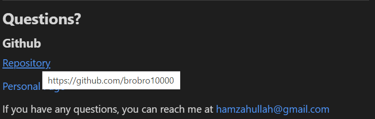

# The Readme Generator

## **The Readme Generator**
This program allows you to create a template of a professional markdown for github. Following the guide for a [professional readme](https://github.com/coding-boot-camp/potential-enigma/blob/main/readme-guide.md), we can create all the required features of a professional readme, and fill in the data more extensively once it has been generated. 

- After the user enters 'node index', they are answed a series of questions to fill in the readme with the preliminary data. The node package used to generate the structure is the [inquirer](https://www.npmjs.com/package/inquirer) package.

- Once the user has successfully entered the required prompts, a readme is generated for the user. It is currently named 'sampleReadme'.

- If a markdown already exist that was generated by the generator, it will not delete your old one. Instead, it will generate you a new one in the order it was generated. 

- The header of the readme includes the title of the project, as well as the license badges at the very top. The badges are generated through [shield.io](https://shields.io/). The colors of the shields generated match the official colors specified by their specific licenses. Clicking on the badges will forward you to [https://choosealicense.com/](https://choosealicense.com/), for each respective license. 

- The same can be done in the license section of the Readme.

- To navigate quickly around the readme, you can use the table of contents that has been generated. This will always be generated. 

- The contribution section also allows you to allow or disallow contributions. If the user is not allowed to contribute then the following message is displayed 

- Otherwise, a full code of conduct is generated. The code of conducts is derived from the [The Contributers Covenant Guidelines](https://www.contributor-covenant.org/). It sets the rules and standards of open source contribution. 

- Finally, the questions section allows the user to reach out to the developer by reaching his repository or personal github page. There is also an attached email for further questions. 

# Why it Matters?
Using node, and the node package manager, we can implement powerful tools using javascript. The readme generator is simply the tip of the iceberg. The readme generator is an example of how a user can design the code to suit their perosnal needs, and streamline their workflow. Developing for a masses, developers can provide tools and services to businesses and individuals that streamlines their workflow, allowing for more efficient use of time, such as the readme generator does for developers in creating markdowns.

Watch my Readme Generator in action!

## 
We Hope to see you there!
 ##
